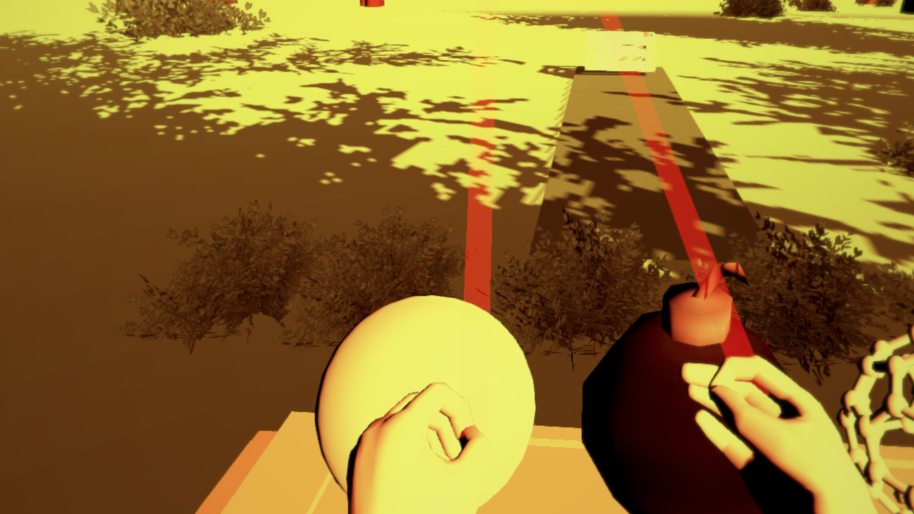

# Resumen

G-Toss es un juego de lanzamiento de realidad virtual intergaláctico.
Este juego tiene una mecánica muy sencilla, la de tirar un objeto esférico en una cesta o similar para combatir el aburrimiento momentáneo.
Actualmente dispone de 4 niveles: Tutorial, La Tierra, La Luna y Marte.

## Capturas del juego

### Menú principal

### Tutorial

### La Tierra

### La Luna

### Marte

